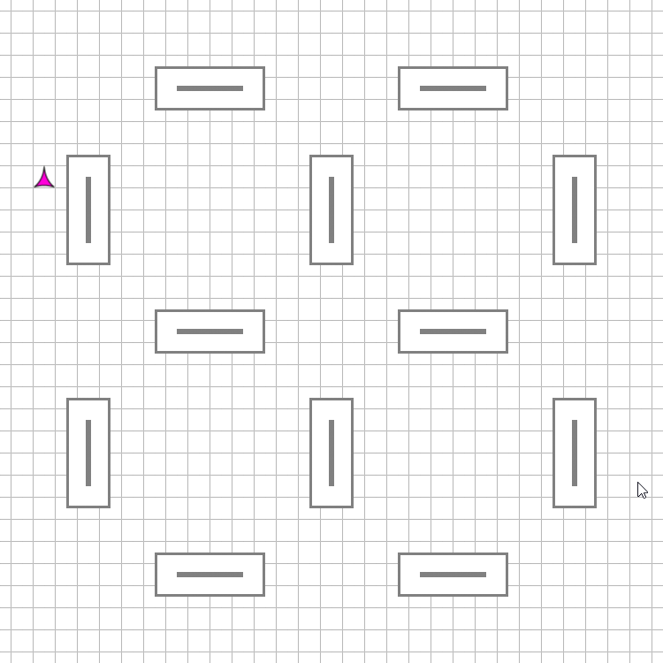
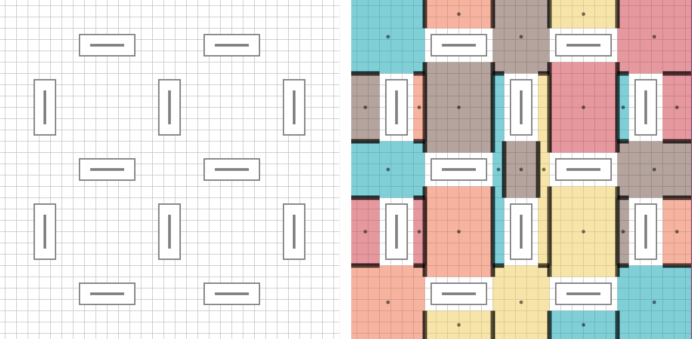

# Navigation Meshes in Phaser <!-- omit in toc -->

A [Phaser](http://phaser.io/) plugin for fast pathfinding using navigation meshes.

[](https://www.mikewesthad.com/phaser-navmesh/demo/)

[Interactive demo](https://www.mikewesthad.com/phaser-navmesh/demo/)

Table of Contents:

- [Intro](#intro)
- [Temporary Performance Comparison](#temporary-performance-comparison)
- [Installation](#installation)
  - [As a Script](#as-a-script)
  - [As a Module](#as-a-module)
- [Create a Nav Mesh](#create-a-nav-mesh)
- [Usage](#usage)
- [Development](#development)
- [References](#references)
- [TODO](#todo)

## Intro

Pathfinding is essentially solving a maze, finding a path between two points while avoiding obstacles. When pathfinding in games, we need to:

1.  Represent the game world in a way that defines what areas are walkable.
2.  Search that representation for the shortest path.

When it comes to 2D pathfinding in [Phaser](http://phaser.io/), the [packaged solution](https://github.com/photonstorm/phaser-plugins) represents the world using [tiles](https://developer.mozilla.org/en-US/docs/Games/Techniques/Tilemaps) (a grid) and then searchs for a path using the [A\* algorithm](https://en.wikipedia.org/wiki/A*_search_algorithm). If you have a 50 x 50 tile world, searching for a path involves searching through a representation of the world with up to 2500 locations (nodes).

This plugin uses navigation meshes to simplify that search. Instead of representing the world as a grid of tiles, it represents the walkable areas of the world as a mesh. That means that the representation of the world has far fewer nodes, and hence, can be searched much faster than the grid approach. This approach is 5x - 150x faster than Phaser's A\* plugin (see performance section).

The example map below (left) is a 30 x 30 map. As a grid, there are 900 nodes, but as a navmesh (right) there are 27 nodes (colored rectangles).



(Note: if you are viewing this on GitHub or NPM, you might want to check out the HTML documentation [here](https://www.mikewesthad.com/phaser-navmesh/docs/).)

## Temporary Performance Comparison

TODO: make this more readable and add interactive demo

Comparing this navmesh plugin against:

- [Phaser's grid-based A\* plugin](https://github.com/photonstorm/phaser-plugins). Navmesh is approximately 5x - 150x faster.
- A faster, grid-based A\* search, [EasyStar.js](https://github.com/prettymuchbryce/easystarjs). Navmesh is approximately 5x - 20x faster.

Performance depends on the size of the area that needs to be searched. Finding for a path between points that are 50 pixels away is (generally) going to be much faster than finding a path between points that are 5000 pixels away.

Details (see [src/library/performance](https://github.com/mikewesthad/phaser-navmesh/tree/master/src/examples/performance)):

```
Performance Comparison, 100000 iterations, 30x30 tilemap

Short paths (150 - 500 pixel length)

    Average time per iteration:
        AStart Plugin: 0.02470ms
        EasyStar Plugin: 0.02876ms
        NavMesh Plugin: 0.00575ms

    Comparison:
        NavMesh is 4.30x faster than Phaser AStar
        NavMesh is 5.00x faster than EasyStar

Long paths (600 pixels and greater length), average time per iteration:

    Average time per iteration:
        AStart Plugin: 1.38710ms
        EasyStar Plugin: 0.15977ms
        NavMesh Plugin: 0.00738ms

    Comparison:
        NavMesh is 187.95x faster than Phaser AStar
        NavMesh is 21.65x faster than EasyStar
```

## Installation

Whether you include the library as a script tag or import it as a module, Phaser is a dependency. The library expects Phaser to be in the global scope.

### As a Script

Download the dist/phaser-navmesh.min.js [here](https://raw.githubusercontent.com/mikewesthad/phaser-navmesh/master/dist/phaser-navmesh.min.js) and include it in your HTML:

```html
<script src="dist/phaser-navmesh.min.js"></script>
```

Inside of your own script, you can now use the global PhaserNavmesh:

```js
this.game.plugins.add(PhaserNavmesh);
```

### As a Module

Install the dependency:

```
npm install --save phaser-navmesh
```

To use the babelified and minified library:

```js
import PhaserNavmesh from "phaser-navmesh";
this.game.plugins.add(PhaserNavmesh);
```

To use the raw es6 library (so you can transpile it to match your own project settings):

```js
import PhaserNavmesh from "phaser-navmesh/src/library";
this.game.plugins.add(PhaserNavmesh);
```

## Create a Nav Mesh

See [guide](./tiled-navmesh-guide.md).

## Usage

```js
// This snippet assumes you've got your tilemap loaded in a variable called "tilemap"

// Register the plugin with Phaser
const navMeshPlugin = this.game.plugins.add(phaserNavmesh);

// Load the navMesh from the tilemap object layer "navmesh." The navMesh was created with 12.5
// pixels of space around obstacles.
const navMesh = navMeshPlugin.buildMeshFromTiled(tilemap, "navmesh", 12.5);

const p1 = new Phaser.Point(100, 400);
const p2 = new Phaser.Point(700, 200);
const path = navMesh.findPath(p1, p2);
// -> path is now either an array of points, or null if no valid path could be found
```

Visually debugging paths:

```js
navMesh.enableDebug(); // Creates a Phaser.Graphics overlay on top of the screen
navMesh.debugClear(); // Clears the overlay
// Visualize the underlying navmesh
navMesh.debugDrawMesh({
  drawCentroid: true,
  drawBounds: false,
  drawNeighbors: true,
  drawPortals: true
});
// Find & visualize a specific path
const path = navMesh.findPath(follower.position, target, {
  drawPolyPath: true,
  drawFinalPath: true
});
```

## Development

Pull requests are welcome! If you want to run this repo locally, make sure you have [node](https://nodejs.org/en/) installed. Download the repo, open a terminal in the repo folder and run:

```
npm install
npm run bootstrap
```

This project uses [lerna](https://github.com/lerna/lerna) and [yarn workspaces](https://yarnpkg.com/lang/en/docs/workspaces/) to manage multiple packages within one repository. `npm install` will pull the root dependencies and `npm run bootstrap` will use lerna & yarn to pull and link dependencies within "packages/".

The project is controlled via npm scripts. The main ones to use:

- `npm run build` - will build all the individual packages within "packages/".
- `npm run dev` - watch & serve the examples. A browser window will pop up with links to the examples. If you are working on the library, this is the easiest way to do "functional testing" by using the library in a game environment.
- `npm run test` - will run the automated tests against the library.

## References

Helpful resources used while building this plugin:

- Inspired by [PatrolJS](https://github.com/nickjanssen/PatrolJS), an implementation of navmeshes for threejs
- Navmesh path-finding algorithm explanations:
  - [Game Path Planning by Julian Ceipek](http://jceipek.com/Olin-Coding-Tutorials/pathing.html)
  - [Simple Stupid Funnel Algorithm](http://digestingduck.blogspot.com/2010/03/simple-stupid-funnel-algorithm.html)
- [Advice on astar heuristics](http://theory.stanford.edu/~amitp/GameProgramming/Heuristics.html)

## TODO

- Documentation
  - Describe the Tiled process. Adding an object layer, setting snapping, making sure vertices overlap...
- Specific Extensions
  - Allow non-square navmesh from Tiled - any convex shape
  - Reimplement the autotessalation version of the lib
  - Try libtess in quad mode
  - The astar heuristic & cost functions need another pass. They don't always produce the shortest path. Implement incomplete funneling while building the astar path?
  - The navmesh assumes any polygon can reach any other polygon. This probably should be extended to put connected polygons into groups like patroljs.
- Testing
  - Check against tilemap that is larger than the screen
- Research
  - There are probably optimization tricks to do when dealing with certain types of shapes. E.g. we are using axis-aligned boxes for the polygons and it is dead simple to calculate if a point is inside one of those...
  - Investigate [Points-of-Visibility](http://www.david-gouveia.com/portfolio/pathfinding-on-a-2d-polygonal-map/) pathfinding to compare speed
