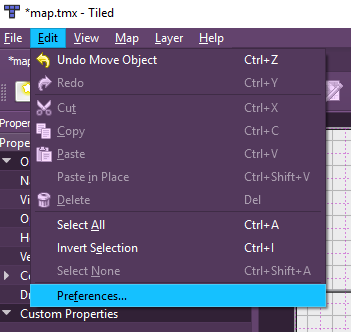

# Creating a NavMesh in Tiled

[Tiled](http://www.mapeditor.org/) is an open source tile map editor. If you are already using it to design your levels, then you can also use it to create your nav meshes. 

Tiled allows you to design a map by creating [layers](http://doc.mapeditor.org/manual/layers/) of tiles & objects. A tile layer allows you to place images from your tileset onto the grid of the world. An object layer allows you to store other kinds of information. Phaser can read both tile layers and object layers, so we can use the object layer to represent a nav mesh. In the image below, there is a layer of tiles (called "walls") and a layer of gray rectangles that represents the nav mesh (called "navmesh")

This guide assumes you have some familiarity with Tiled. If you don't know Tiled, check out gamefromscratch's video [tutorial series](http://www.gamefromscratch.com/post/2015/10/14/Tiled-Map-Editor-Tutorial-Series.aspx)/.

## Setup

Open up your map or create a new one. You'll want to set up a grid and enable snapping before creating the nav mesh. Open up preferences (`Edit ⟶ Preferences`):

Set the fine grid divisions. This allows you to snap objects "in-between" the grid. E.g. on a 25px x 25px tile map with 5 grid divisions, the fine grid would be every 5px.

Enable snapping (`View ⟶ Snapping`):

## Creating the Mesh

Create a new object layer and name it "navmesh." Then start adding in rectangles to define your nav mesh. (Note: rectangles are the only Tiled shape currently supported by this plugin.)

Notice the space being left around the walls? When you use the plugin to find a path, the path will end up hugging the edges and corners of the mesh. If you were to use a path like that to move a physics object around, it would likely get caught on those corners. You can either write more complicated path following logic, or you can "bake" the agent's size into the nav mesh by leaving space between the mesh and the obstacles in the world.

See the Tiled manual for more information on [objects](http://doc.mapeditor.org/manual/objects/#working-with-objects).